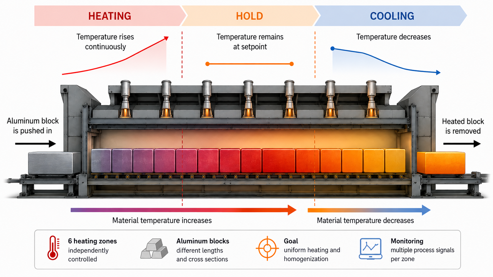

# Laila Gruber Portfolio

This repository contains the source code for a bilingual personal portfolio website by **Laila Gruber**.
The website is a lightweight static site and presents Laila's profile, project overview, contact details and a dedicated project page for the research project **“Machine Learning Based Anomaly Detection in Industrial Pusher Furnaces”**.

## What the website includes

- a clean one-page **home page** with hero section, about section, timeline, projects and contact
- a dedicated **project detail page** for Project 01
- **English and German language switching**
- **English as the default language**
- automatic replacement of the **project figures** when the language is changed
- responsive layout for desktop and mobile
- static setup that can be hosted easily via **GitHub Pages**

## Language behaviour

The site starts in **English** by default.
Visitors can switch between **EN** and **DE** in the header.
The selected language is stored in the browser so the website remembers the last chosen language on later visits.

On the project page, the language switch does not only translate the text. It also swaps the figures: 

- English figures are shown when **EN** is active
- German figures are shown when **DE** is active

This is handled in `script.js` via the `data-image-en` and `data-image-de` attributes on the figure images in `project-01.html`.

## Project structure

```
.
├── index.html
├── project-01.html
├── styles.css
├── script.js
├── README.md
└── assets/
    ├── portrait.png
    ├── figure-01-pusher-furnace-process.png
    ├── figure-01-pusher-furnace-process-de.png
    ├── figure-02-model-groups.png
    ├── figure-02-model-groups-de.png
    ├── figure-03-model-comparison-workflow.png
    ├── figure-03-model-comparison-workflow-de.png
    ├── figure-04-prioritized-models.png
    └── figure-04-prioritized-models-de.png
```

## Main files

### `index.html`
Contains the landing page with:
- header and navigation
- hero section
- about section
- timeline section
- projects section
- contact section

### `project-01.html`
Contains the detailed project page for the pusher furnace research project.
This page also contains the figure elements that switch between English and German image versions.

### `styles.css`
Contains the full visual styling of the website including layout, typography, spacing, buttons, cards, figures and responsive behaviour.

### `script.js`
Handles:
- all website translations
- language switching
- saving the selected language in local storage
- swapping localized figures on the project page
- active navigation highlighting
- footer year update

## How figure switching works

Each relevant image on the project page contains attributes like these:

```html

```

When the language changes, `script.js` updates the `src` of the image automatically.
If needed, you can use the same logic for more localized graphics later.

## Editing content

### Change texts
All translatable texts are stored in `script.js` inside the `translations` object.
If you want to adjust wording in either language, edit the corresponding `de` or `en` values there.

### Replace portrait
Replace the file in:

```
assets/portrait.png
```

Keep the same filename if you do not want to change the HTML.

### Replace project figures
Replace the files in the `assets` folder.
If you use different filenames, make sure to update both `data-image-en` and `data-image-de` inside `project-01.html`.

## Local preview

You can open `index.html` directly in the browser or use the VS Code Live Server extension for a smoother preview.

## Publish with GitHub Pages

After making changes, publish updates with:

```powershell
git add .
git commit -m "Update portfolio"
git push
```

If GitHub Pages is already enabled for the repository, the new version will be deployed automatically after the push.

## Notes

- This is a **static website**, so no build step is required.
- The cache-busting version parameter in the HTML (`styles.css?v=5` and `script.js?v=5`) helps make sure browsers load the latest files after updates.
- If a change is not visible immediately, do a hard refresh in the browser (`Ctrl + F5`).
